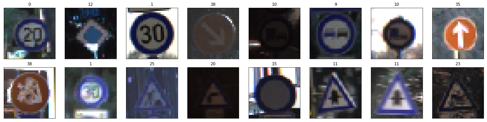
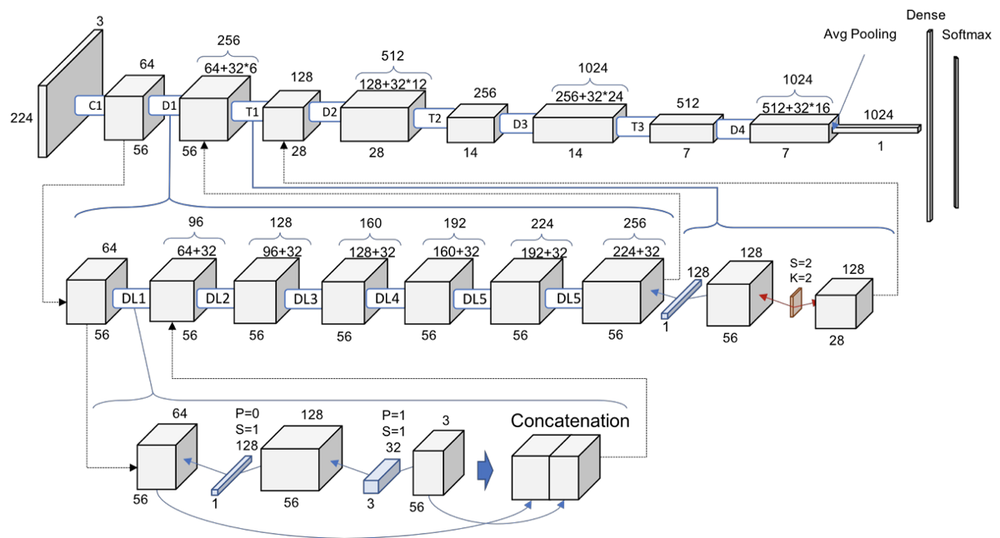
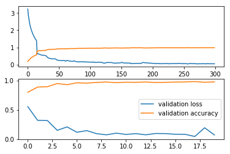
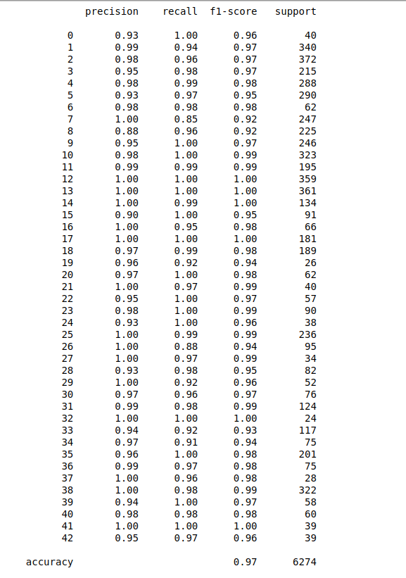

# Traffic Sign Detection

The goal is design an image processing algorithm that can determine the type of the traffic sign that is displayed in an image, and is robust to different real-life conditions such as poor lighting, obstructions or the sign being far away. The code is based on PyTorch.

# Overview

The German Traffic Sign Benchmark is a multi-class, single-image classification challenge held at the International Joint Conference on Neural Networks (IJCNN) 2011. Benchmark has the following properties:

 - Single-image, multi-class classification problem
 - More than 40 classes (42 to be exact)
 - More than 50,000 images in total
 - Large, lifelike database



I trained the network on my own custom created architecture various well known architectures such as **VGG19**, **RESNET-50**, **RESNET-101**, **INCEPTION** and finally **DENSENET-169**. I achieved the highest accuracy on **DENSENET-169** model of about 98.282%.



## Contents
  - [1. Setup Instructions and Dependencies](#1-Setup-Instructions-and-Dependencies)
  - [2. Dataset](#2-Dataset)
  - [3. Training the model](#3-Training-the-model)
  - [4. Observations](#4-Observations)
  - [5. Repository overview](#5-Repository-overview)


## 1. Setup Instructions and Dependencies

Clone the repositiory on your local machine.

``` Batchfile
git clone https://github.com/ishanrai05/traffic-sign-detection
```

Start a virtual environment using python3
``` Batchfile
virtualenv env
```


Install the dependencies
``` Batchfile
pip install -r requirements.txt
```

You can also use google collab notebook. In that case just upload the notebook provided in the repository and you are good to go.

## 2. Dataset

The dataset is available to download from the official site [here](http://benchmark.ini.rub.de/?section=gtsrb&subsection=news). Download and extract the dataset in `input` folder in the same directory.

## 3. Training the model

To train the model, run

```Batchfile
python main.py --train=True
```

optional arguments:
  | argument | default | desciption|
  | --- | --- | --- |
  | -h, --help | | show help message and exit |
  | --use_cuda | False | device to train on. default is CPU |
  | --samples | False | See sample images |
  | --view_data_counts | False | Visualize data distribution |
  | --model | densenet | resnet,vgg,densenet,inception |
  | --num_epochs | 10 | Number of epochs to train on |
  | --train | True | train the model |

# 4. Observations

I achieved a training accuracy as high as 98.719% and validation accuracy as high as 98.282%.

The top graph indicates training loss(blue line) and training accuracy(orange line)



### Classification Report



## 5. Repository overview


This repository contains the following files and folders

1. **notebook**: This folder contains the jupyter notebook for code.

2. **resources**: Contains images.

3. `dataset_loader.py`: pytorch code to load the dataset.

4. `models.py`: code for models.

5. `read_data.py`: code to read images.

6. `visualize.py`: code for visualizations.

7. `utils.py`: Contains helper functions.

8. `train.py`: function to train models from scratch.

9. `main.py`: contains main code to run the model.

10. `requirements.txt`: Lists dependencies for easy setup in virtual environments.

